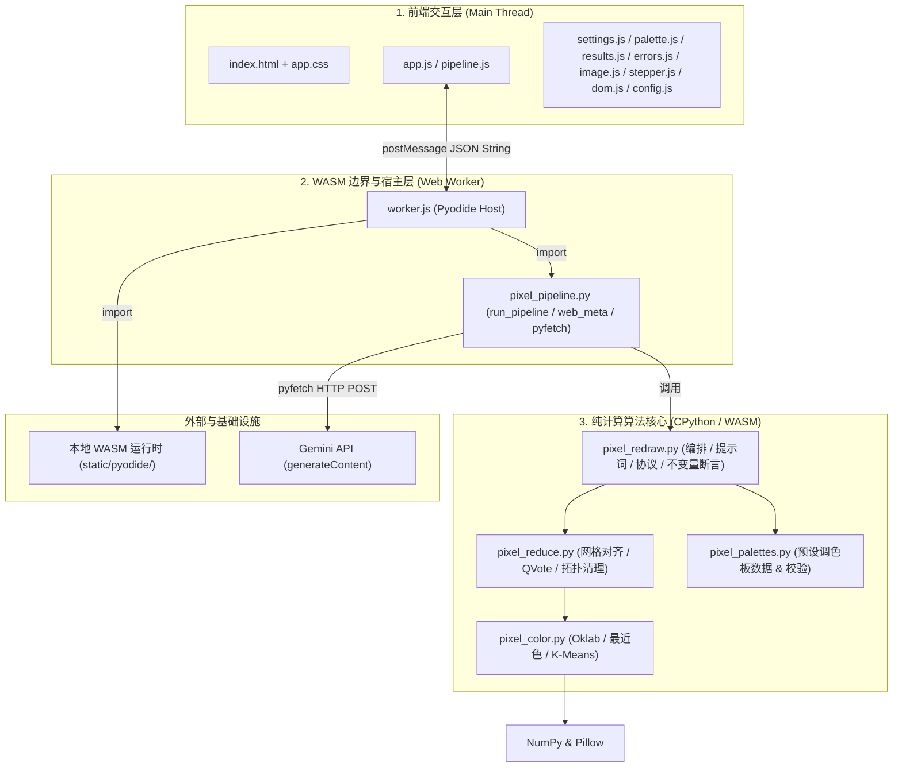

# Architecture Overview

`pixel-redraw` 是一个**纯静态、无后端的 AI 像素画重绘系统**。用户在浏览器中提供 Google Gemini API Key，由浏览器直接调用大模型，并通过 Pyodide (WASM CPython) 在客户端本地完成像素化、感知调色板映射与拓扑清理。

---

## 1. 架构分层与模块划分

系统分为四层：前端交互层、WASM 边界层、纯计算核心层与基础设施层。



---

## 2. 模块职责与依赖方向

| 层次 | 文件 / 模块 | 核心职责 | 依赖方向 |
|---|---|---|---|
| **前端交互层** | [`static/index.html`](file:///Users/akiya/Project/pixel/static/index.html)<br>[`static/app.css`](file:///Users/akiya/Project/pixel/static/app.css)<br>[`static/js/app.js`](file:///Users/akiya/Project/pixel/static/js/app.js) | UI 布局、状态呈现、事件驱动、模块装配与用户交互。 | 依赖各前端功能子模块 |
| | [`static/js/pipeline.js`](file:///Users/akiya/Project/pixel/static/js/pipeline.js) | 管理 Worker 生命周期、任务排队与进度分发。 | 依赖 `worker.js` 通信 |
| | [`static/js/settings.js`](file:///Users/akiya/Project/pixel/static/js/settings.js) | API Key、模型等配置的本地存取及渲染层第二道脱敏。 | 无业务算法依赖 |
| | [`static/js/palette.js`](file:///Users/akiya/Project/pixel/static/js/palette.js) / [`results.js`](file:///Users/akiya/Project/pixel/static/js/results.js) / [`errors.js`](file:///Users/akiya/Project/pixel/static/js/errors.js) / [`image.js`](file:///Users/akiya/Project/pixel/static/js/image.js) | 调色板选择、图像 Canvas 渲染、错误徽章呈现及诊断导出。 | 纯 UI 辅助 |
| **WASM 边界层** | [`static/js/worker.js`](file:///Users/akiya/Project/pixel/static/js/worker.js) | 加载本地 Pyodide 运行环境（CPython 3.14+ / Pillow / NumPy）并装载 Python 脚本。 | 依赖本地 `static/pyodide/` |
| | [`pixel_pipeline.py`](file:///Users/akiya/Project/pixel/pixel_pipeline.py) | **唯一的 Pyodide 适配模块**。提供 `web_meta()` 和 `run_pipeline()` 接口，使用 `pyodide.http.pyfetch` 进行网络传输，包装脱敏错误信封。 | 依赖 `pixel_redraw.py`, `pixel_palettes.py`, `pyodide` |
| **纯计算核心层** | [`pixel_redraw.py`](file:///Users/akiya/Project/pixel/pixel_redraw.py) | **纯计算**。Gemini 请求 payload 组装、响应解析、两轮生成流程编排、调色板子集断言。 | 依赖 `pixel_reduce.py`, `pixel_palettes.py`, `pixel_color.py` |
| | [`pixel_reduce.py`](file:///Users/akiya/Project/pixel/pixel_reduce.py) | **纯计算**。目标网格计算、网格相位微移对齐 (Grid Phase Alignment)、QVote (Quantize-then-Vote) 区域多数表决量化、置信度拓扑清理。 | 依赖 `pixel_color.py`, `PIL.Image`, `numpy` |
| | [`pixel_color.py`](file:///Users/akiya/Project/pixel/pixel_color.py) | **纯计算**。`sRGB` $\leftrightarrow$ `Linear RGB` $\leftrightarrow$ `Oklab` 感知色彩转换、Oklab 最近色映射、确定性 K-Means 自动调色板生成、加权感知误差贪心剪枝子集提取 (`select_sub_palette`)。 | 依赖 `numpy` |
| | [`pixel_palettes.py`](file:///Users/akiya/Project/pixel/pixel_palettes.py) | 15 个硬件与艺术预设调色板数据及启动时自检。 | 依赖 `pixel_redraw.py` (仅用于语法自检) |
| **基础设施与工具** | [`deploy/nginx.conf`](file:///Users/akiya/Project/pixel/deploy/nginx.conf) / [`Dockerfile`](file:///Users/akiya/Project/pixel/Dockerfile) | 静态站部署，配置 `.wasm` / `.mjs` MIME 类型。 | 纯静态分发 |
| | [`tools/serve.mjs`](file:///Users/akiya/Project/pixel/tools/serve.mjs) / [`tools/linkcheck.mjs`](file:///Users/akiya/Project/pixel/tools/linkcheck.mjs) | 本地开发服务器（带 `no-store` 防止缓存）及静态链接检查。 | Node.js 运行环境 |
| | [`tests/test_core.py`](file:///Users/akiya/Project/pixel/tests/test_core.py) / [`tests/test_refactor.py`](file:///Users/akiya/Project/pixel/tests/test_refactor.py) | 核心算法单元测试、纯度契约扫描、像素化不变量验证。 | CPython 3.9+ |

---

## 3. 关键数据流

### 3.1 双轮生成与像素化数据流 (Two-Pass Pipeline)

```text
[ 用户输入原图 Base64 ]
        │
        ├─► [ 本地自适应降采样 (Auto色板 + 5档自适应密度) ] ──► [ 生成自适应参考 Guide (输出至左侧卡片) ]
        │                                                                     │
        ▼ (Pass 1: 语义构图与草稿)                                             │
[ 组装 Prompt 1 (原图 + 自适应 Guide) ] ──► [ pyfetch POST ] ──► [ 初稿高分辨率图 Raw 1 (输出至中间卡片) ]
                                                                                │
                                                                                ▼
                                                                [ Reducer (按用户目标色板与密度量化) ]
                                                                                │
        ┌───────────────────────────────────────────────────────────────────────┘
        ▼
[ 生成目标风格草稿 (Nearest-Neighbor 放大) ]
        │
        ▼ (Pass 2: 目标风格点阵精修)
[ 组装 Prompt 2 (目标草稿 + 原图参考) ] ──► [ Upstream HTTP POST ] ──► [ 精修高分辨率图 Raw 2 ]
                                                                                │
                                                        (失败时回退至首轮) ◄──────┤
                                                                                ▼
                                                                [ Reducer (按用户目标色板与密度量化) ]
                                                                                │
                                                                                ▼
                                                                [ 调色板闭包断言检查 ]
                                                                                │
                                                                                ▼
                                                                [ 最终逻辑像素图 (输出至右侧卡片) + 脱敏元数据 JSON ]
```

### 3.2 仅本地渲染 / 调色板重采样数据流 (Repixelize Flow)

当用户勾选「仅本地渲染」或在生成后调整密度/切换调色板时：
1. 前端跳过模型调用，将当前输入图或内存中缓存的原始模型输出（Raw Output）直接传入 `run_pipeline`。
2. Reducer 直接在 WASM 内运行 QVote 与色彩映射，耗时仅需数十毫秒，消耗 0 Token。

---

## 4. 架构边界与核心契约

### 4.1 纯计算契约 (Pure Compute Boundary)
`pixel_redraw.py`、`pixel_reduce.py`、`pixel_color.py` 必须保持无副作用（不读环境变量、不访问文件系统、不持有网络套接字）。所有外部网络调用通过参数注入。该契约受 `tests/test_core.py` 源码扫描测试严格保护。

### 4.2 跨语言传输契约 (JSON String Barrier)
JavaScript 与 Python (Pyodide) 之间传递数据时，仅传递纯文本 JSON 字符串与 Base64 图像，严禁传递复杂的 JS/Python 包装对象（`PyProxy`），从而从根源上避免内存泄漏与垃圾回收生命周期冲突。

### 4.3 凭据安全与脱敏防线 (Security Boundary)
API Key 仅存在于用户浏览器内存或 `sessionStorage`（用户自选 `localStorage`），由 Python 侧 `to_envelope()` 与前端 `redactSecrets()` 构成双层脱敏防线，确保任何异常、traceback、页面展示与导出文件中均不含明文 Key。
